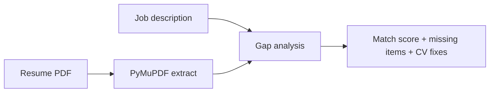

# Career Aligner

**An AI career agent that tells you what's missing — not what's already on your CV.**

Upload a resume PDF, paste a job description, and get a match score plus short, direct feedback on gaps and CV fixes. Built by an MSc AI student for real job applications.

[](https://github.com/VamshiKrishnaBandari07/agentic-career-aligner/actions/workflows/ci.yml)
[](https://www.python.org/downloads/)
[](https://fastapi.tiangolo.com/)
[](LICENSE)

---

## Highlights

- **Gap-focused feedback** — only what you're missing, in plain English
- **Works immediately** — free local mode, no API key required
- **Optional AI mode** — GPT-powered analysis with your own OpenAI key
- **Professional web UI** + **REST API** with Swagger docs
- **Private by default** — runs on your machine; your CV never leaves it

---

## Quick start

### Windows

```bat
git clone https://github.com/VamshiKrishnaBandari07/agentic-career-aligner.git
cd agentic-career-aligner
run.bat
```

### Mac / Linux

```bash
git clone https://github.com/VamshiKrishnaBandari07/agentic-career-aligner.git
cd agentic-career-aligner
chmod +x run.sh && ./run.sh
```

Open **http://127.0.0.1:8000** → upload resume → paste job description → **Run agent analysis**

---

## What you get

| Output | Description |
|--------|-------------|
| **Match score** | Overall fit (0–100%) for this specific role |
| **Missing skills** | Tools/tech the job wants that your CV lacks |
| **Missing requirements** | Responsibilities not reflected on your resume |
| **Missing qualifications** | Degree, certs, or years-of-experience gaps |
| **CV fixes** | Short, actionable edits to make before applying |
| **Next steps** | Priority actions to close the gap |

---

## How it works



**Local mode (default):** rule-based skill and requirement matching — free, offline, no account.

**AI mode:** embeddings + GPT for deeper semantic analysis — set `OPENAI_API_KEY` in `.env`.

---

## Configuration

Copy `.env.example` to `.env`:

```env
MATCH_PROVIDER=free          # free | openai
OPENAI_API_KEY=              # required only for openai mode
SERVE_UI=true                # web UI at / (false = API docs only)
```

| Mode | API key | Best for |
|------|---------|----------|
| `free` | Not needed | Instant local use, privacy, zero cost |
| `openai` | Required | Richer AI feedback via GPT |

If `openai` is set without a valid key, the app **falls back to local mode** automatically.

---

## API

Interactive docs: **http://127.0.0.1:8000/docs**

| Endpoint | Method | Description |
|----------|--------|-------------|
| `/` | GET | Web UI |
| `/match` | POST | Resume PDF + job text → analysis |
| `/parse` | POST | Extract text from a PDF |
| `/health` | GET | Server status |
| `/docs` | GET | Swagger UI |

**Example**

```bash
curl -X POST "http://127.0.0.1:8000/match" \
  -F "resume=@resume.pdf" \
  -F "job_description=Requirements: Python, PyTorch, NLP..." \
  -F "company_about=AI startup building NLP products"
```

---

## Project structure

```
src/job_matcher/
├── api/                 # FastAPI routes & dependencies
├── core/                # Config, pipeline, schemas
├── services/
│   ├── analysis/        # Gap analyzer
│   ├── comparison/      # Local + OpenAI comparators
│   ├── feedback/        # Human-readable suggestions
│   ├── pdf/             # PDF text extraction
│   └── skills/          # Skill extraction
├── integrations/        # OpenAI client
└── static/              # Web UI
```

---

## Development

```bash
python -m venv .venv
.venv\Scripts\activate       # Windows
# source .venv/bin/activate  # Mac/Linux
pip install -e ".[dev]"
pytest
```

---

## Tech stack

Python · FastAPI · PyMuPDF · Pydantic · NumPy · Uvicorn · OpenAI (optional)

---

## Author

**Vamshi Krishna Bandari** — MSc Artificial Intelligence

[GitHub](https://github.com/VamshiKrishnaBandari07)

---

## License

MIT — use it, fork it, share it. See [LICENSE](LICENSE).
